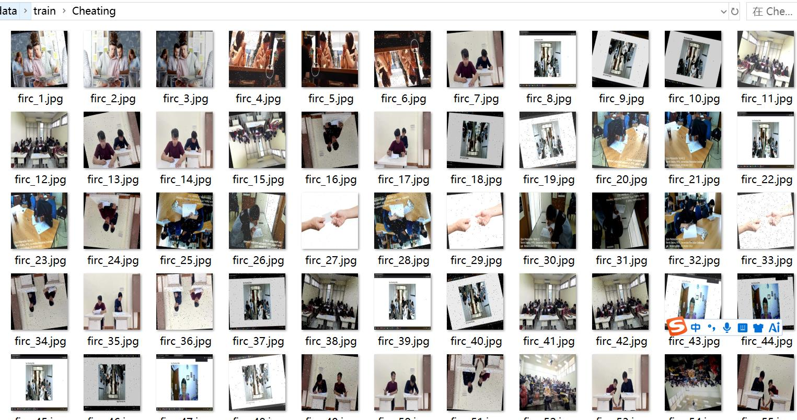
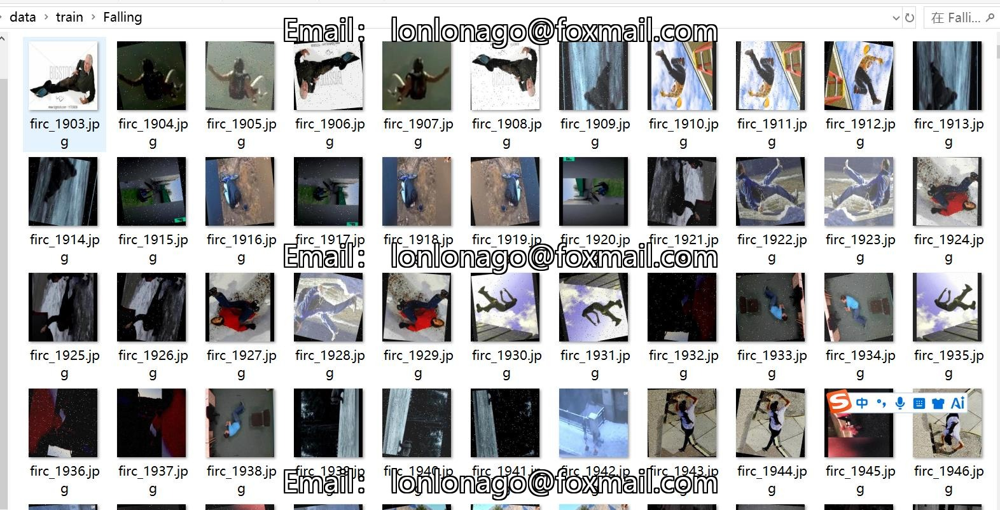
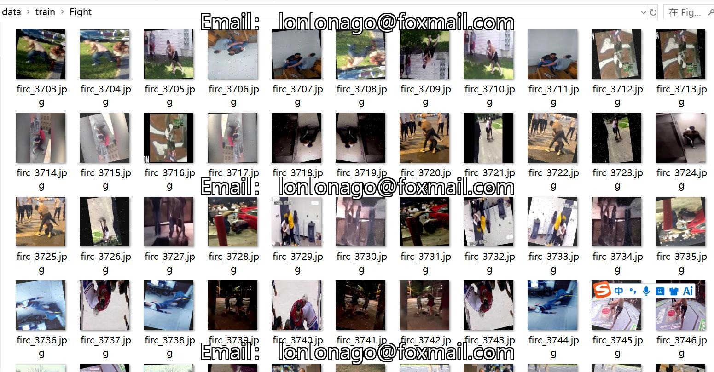
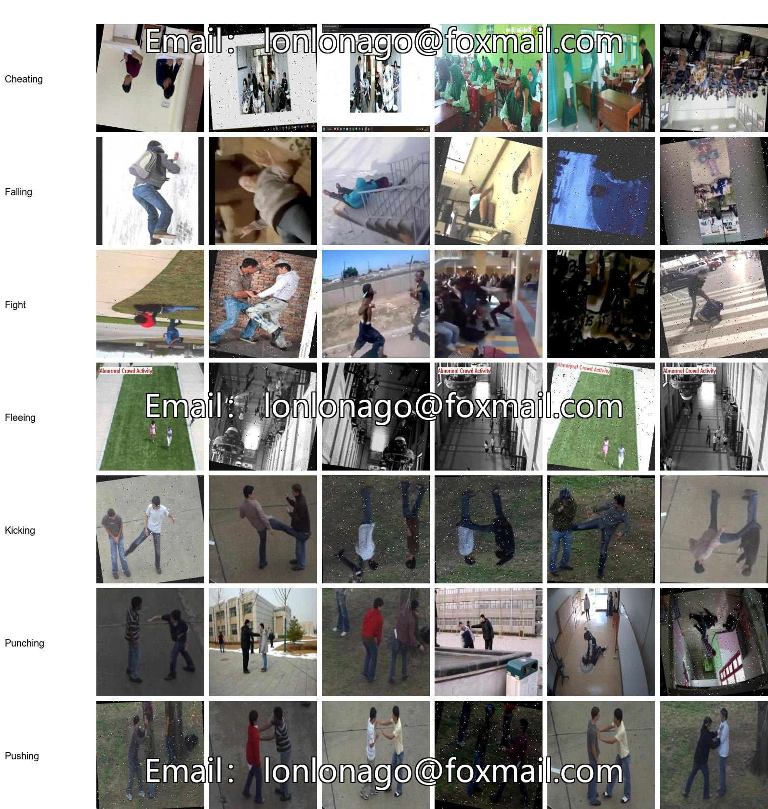

# Exception Behavior Identification Image Classification Dataset 13965 Images in 7 Classes with Enhanced Images

Please note that approximately 5000 images are original and the rest are enhanced images, mainly rotation and noise enhancement. The image resolution is 224x244 which is quite small.

The dataset type is for image classification use only and should not be used for object detection without labeled files.

The dataset format consists solely of JPG images, with each category folder containing the corresponding images.

The number of images (jpg file counts): 13965

The number of categories: 7

The image resolution: 224x224

Category names: ['Cheating', 'Falling', 'Fight', 'Fleeing', 'Kicking', 'Punching', 'Pushing']

Each category has a different number of images:
- Training set images count: 12888
- Training set images count: 12888
- Cheating (cheating) training set images count: 1902
- Falling (falling) training set images count: 1800
- Fight (fight) training set images count: 1836
- Fleeing (fleeing) training set images count: 1887
- Kicking (kicking) training set images count: 1803
- Punching (punching) training set images count: 1854
- Pushing (pushing) training set images count: 1806

Validation set images count: 539
- Cheating (cheating) validation set images count: 62
- Falling (falling) validation set images count: 91
- Fight (fight) validation set images count: 81
- Fleeing (fleeing) validation set images count: 61
- Kicking (kicking) validation set images count: 86
- Punching (punching) validation set images count: 71
- Pushing (pushing) validation set images count: 87

Test set images count: 538
- Cheating (cheating) test set images count: 69
- Falling (falling) test set images count: 78
- Fight (fight) test set images count: 74
- Fleeing (fleeing) test set images count: 77
- Kicking (kicking) test set images count: 80
- Punching (punching) test set images count: 79
- Pushing (pushing) test set images count: 81

Total images count:
- Cheating (cheating) total images count: 2033
- Falling (falling) total images count: 1969
- Fight (fight) total images count: 1991
- Fleeing (fleeing) total images count: 2025
- Kicking (kicking) total images count: 1969
- Punching (punching) total images count: 2004
- Pushing (pushing) total images count: 1974

Important Notes: There are no additional notes at this time.
Special Declaration: This dataset does not guarantee the precision of the trained models or weight files.
Image previews:

## Images

Here is a pay link on Stripe ( https://buy.stripe.com/3cs8yP7sY87d0vu9AB ). Please contact me lonlonago@foxmail.com after funding $89, and I will send you a complete data files , thank you!

